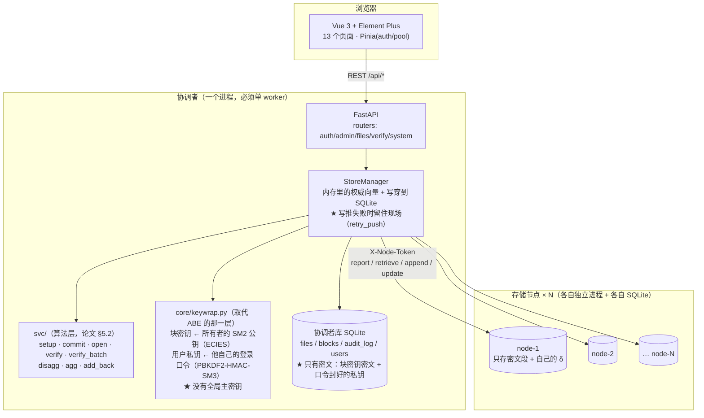
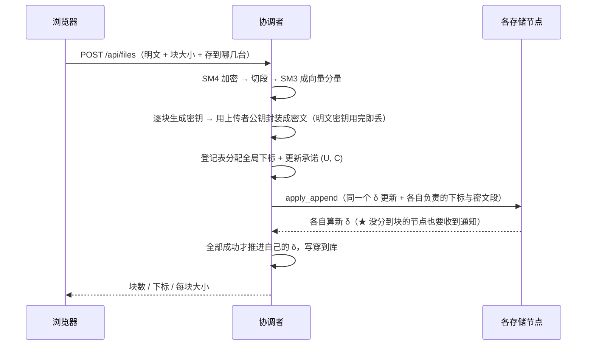
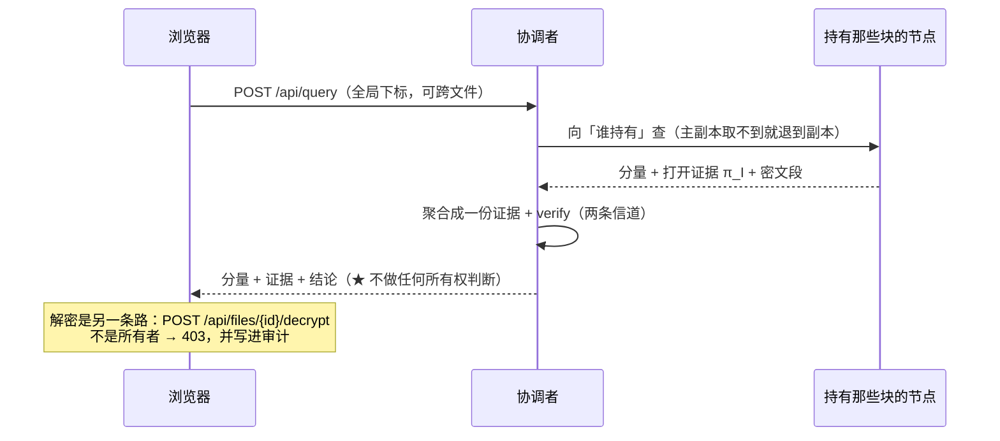

# 方案设计

> 本文档归纳自原 `架构说明.md` 与 `README.md` 中的设计部分，回答「**为什么这么设计、舍了什么、代价是什么**」。
> 想快速跑起来看效果，见 [`复现指南.md`](复现指南.md)；想快速了解项目是什么，见仓库根目录的 `README.md`。

> [!IMPORTANT]
> **本文第 1 节描述的是「设计 B：全系统一条向量」，那是论文 §5.2 的原样形状。
> 发货版本已经偏离它两点，读本文时请以这两条为准**（细节见
> [`开发与验收记录.md`](开发与验收记录.md) 第五、六、十四章）：
>
> 1. **一文件一向量**：每份文件各自一条向量、各自的 δ。跨文件验证不是“天然合成”，
>    而是在**合并位置集**上重算一份证据与合并承诺（秒级）。
> 2. **素数按块身份派生**（2026-10）：第 `i` 块的素数由 `H(owner‖file_key‖i)` 决定，
>    **不再查 `[0, n_max)` 那张全局素数表** ⇒ 全局位置分配器、`n_max` 天花板、
>    删除留下的空洞一起消失。论文只要求 `e_i` 互不相同，不要求按顺序对应。
>    `offset` 仍在，但已降级为「密文放在存储节点的哪个槽位」，不参与任何验证。

---

## 1. 核心设计思想

### 1.1 全系统一条向量

所有用户的所有文件都按上传顺序**追加**到同一条向量 `V = (V_0, V_1, …)` 的末尾，共用一份摘要 `δ = ((U, C), n)`、一套公开参数。

由此得到三个能力，也决定了本项目的全部形态：

| 能力 | 含义 |
|---|---|
| **常量摘要** | 客户端只保存 δ —— 两个群元素加一个整数，与文件大小、文件个数都无关 |
| **常量证据** | 一次打开的证据是 `π_I = (S_I, Λ_I)` —— 两个群元素，与打开多少块无关 |
| **一个证据横跨多个文件** | 因为所有块都在同一条向量上，聚合天然跨文件、跨用户。这是选「全系统一条向量」而非「一文件一向量」的全部理由 |

### 1.2 三个已定的设计决定

| # | 决定 | 含义 |
|---|---|---|
| 1 | **全系统一条向量** | 索引必须全系统唯一 ⇒ 必须有全局块索引登记表（`core/registry.py`） |
| 2 | **验证不受限** | δ 是公开的、验证是公开可验证的。任何用户都能验证任意位置的完整性 |
| 3 | **解密受限** | 块密钥被**所有者的 SM2 公钥**封装（`core/keywrap.py`）。只有那把私钥解得开 —— 这是密码学强制，不是一张表说了算 |

**「验证不受限 / 解密受限」是两条独立的线**，也是本项目最需要讲清的一点：

```
验证 = 服务层说了算的程度很低（δ 公开）  →  密码学上挡不住，但它本来也不该挡
解密 = 密码学说了算                      →  就算服务器整个被拿走，没密钥也解不开
```

---

## 2. 密钥层设计

### 2.1 块密钥是怎么被「锁」住的

上传时每块都会现生成一把 16 字节的 SM4 密钥。三件事**同时**发生：

1. 密钥拿去除掉这一段明文（SM4-CTR，每段独立密钥与 IV）；
2. 密钥被**所有者的 SM2 公钥**封装成密文（`BlockRow.key_ct`）；
3. **明文密钥不落到任何地方** —— 它只在内存里活过一次封装的时间。

解密的唯一途径是用所有者手里那把 SM2 私钥把封装解开。

封装用 **ECIES**（`core/keywrap.py`）：

```
每次封装抽一把临时私钥 d，密文里带上 R = d·G
双方各算 z = d·pk_owner / sk_owner·R，值相同（都是 d·sk_owner·G 的 x 坐标）
SM4 密钥 = KDF(z, 加密标签)，密文体用 SM4-CTR 加密
tag      = KDF(z, 认证标签 ‖ R ‖ iv ‖ 密文体)
```

**为什么需要那个 tag**：SM4-CTR 本身不提供完整性。没有 tag 的话，节点把密文体翻一位，解出来的块密钥就变成另一个值，表现是「文件内容是乱的」而不是「这里被篡改了」。有了 tag，篡改在解封这一步就现形。

### 2.2 两层密码学：「只有自己才能解密」不是一句话

```
第 1 层 · 块密钥 ← 用所有者的 SM2 公钥封装
         别人的私钥对它无效 —— 不是「查表发现你没权限」，是算不出来。
第 2 层 · 用户私钥 ← 用他自己的登录口令封装（PBKDF2-HMAC-SM3 → KEK → SM4+tag）
         库里存的只有密文；明文私钥从来没落过盘。
```

第 2 层是「数据库被拿走也解不开」的落点：块密钥用公钥封的，光有数据库解不开；而能解开它的那把私钥，本身又是用口令包着的。口令不落库（库里只有它的加盐哈希，那是登录校验用的另一回事）。

于是「登录」有了明确位置：用口令把私钥解封出来挂到这次令牌上（`users.sk_wrapped` → `StoreManager._keys`，**只在内存**），退出登录丢掉。丢掉之后连本人也解不开 —— 而他照样能验证，因为验证一个密钥字节都不碰。

### 2.3 两道门，但判据只有一条

```
① 应用层 can_decrypt   —— 你不是所有者就不是。提前拒 + 写审计 + 给一句人话，零密码学开销。
② 密码学层 unwrap_key  —— 真的解不开。没有会话私钥 → 403 并叫你重新登录；
                          私钥不对 → 403 并说清「这不是你的密文」。
```

**保留两层是有意的，不是重复**：应用层给得出「为什么拒」的好话术，密码学层才是「算不算得出来」。只留 ① 的话绕过接口层直接读库就能拿到明文；只留 ② 的话用户只看到「算不出来」而不知道为什么。

### 2.4 四个刻意的取舍（都比原来更硬）

1. **管理员也解不开别人的文件。** 以前管理员靠 ABE 的主密钥（KGC 特权）解开一切；现在块密钥用所有者的公钥封，没有第二把钥匙。安全性的提升：少了一个「能解开一切」的单点。
2. **没有全局主密钥文件。** 原来有 `abe_msk.json`（能解开任何密文）；现在它不存在，每一把私钥都由它自己的口令保护。
3. **改口令要重新封装私钥，而且只能自己改。** 只改 `pwd_hash` 会让用户下次登录口令对得上却解不开私钥。所以改口令必须用现在的私钥重包一遍，而「现在的私钥」只在本人登录那一刻进过后端内存 ⇒ 管理员改不了别人的口令（后端 400 拦住，管理员只能停用）。
4. **「授权共享」整个删掉了，不是留空接口。** 旧方案每一步都依赖 ABE；现在想再多封一份给某人，意味着得再多存一份块密钥密文 —— 那是一套新数据结构。要恢复共享，正确做法是给 `blocks` 加一张「额外封装」表，而不是回到 ABE。

---

## 3. 系统架构

### 3.1 进程与模块



**为什么协调者必须单进程单 worker**：全局向量在内存里（设计 B 的代价），多 worker 会各持一份、直接不对。

### 3.2 一次上传（写路径：需要所有节点在线）



### 3.3 一次验证（读路径：验证不受限）



### 3.4 分层与目录

| 层 | 位置 | 职责 | 不该做的事 |
|---|---|---|---|
| 算法 | `svc/` | 向量承诺（Setup/Com/Open/Ver/BatchVer/Disagg/Agg）、PoR | 不认识文件、不碰数据库、不碰 HTTP |
| 引擎 | `core/` | 全局会话与 CRS 引导、`VectorStore`（分片/承诺/增量）、节点状态与传输、SM 算法、密钥封装 | 不认识「用户」「权限」这类应用概念 |
| 节点 | `node_service/` | 独立进程，各持自己的 SQLite；一律要求节点令牌 | 不持有完整明文、不知道块密钥是谁的 |
| 协调者 | `backend/` | 认证、文件账目、写穿、审计、把算法包成 REST | 不留明文密钥、不留明文用户私钥 |
| 界面 | `frontend/` | 13 个页面；Pinia 只放 `auth` 与 `pool` | 不做安全判断（只做体验） |

**数据流一句话**：明文 → SM4 密文 → 切段 → SM3 分量 → 向量承诺 → 分发到 N 台；验证只需 δ 与该份证据；解密需要所有者手里那把 SM2 私钥。

### 3.5 两种运行模式

|  | 单进程（默认） | 跨进程（设了 `VDS_NODE_URLS`） |
|---|---|---|
| 节点是什么 | 同一进程里的 4 个 `NodeState` 对象 | 4 个独立进程，各自一个 `node.db` |
| 协调者拿到什么 | 直接访问 `transport.states[nid]` | 只能 HTTP 说话（`HttpTransport`） |
| 节点状态 / 密文存哪 | 协调者库里（`node_state` / `node_blobs` 表） | 各节点自己的库里 —— 协调者那两张表空着 |
| 代数结果 | 与跨进程逐位相同（有测试钉住） | 同上 |

切换只需要设 / 不设一个环境变量。**两种模式的库不能混用**：协调者启动时发现库里还留着单进程模式的节点状态，会直接拒绝启动（`--reset` 重来）。

---

## 4. 需求 ↔ 实现对照

| # | 需求原句 | 实现落在哪 | 状态 |
|---|---|---|---|
| 1 | 系统化：Vue 前端、管理员/用户登录、数据库、多方控制、数据本地存储 | `frontend/`（Vue 3 + Element Plus + Pinia，18 条路由）；登录 `backend/routers/auth.py`（JWT + bcrypt + 登录时口令解封私钥）；库 `backend/models.py`；各节点独立 SQLite | ✅ |
| 2 | 选择若干证据验证、聚合验证、满足条件才能验证 | `POST /api/query`（一次查询 = 一份证据，可跨文件）；证据池 + `svc.agg`；`svc.verify_batch` + `/api/query/verify-batch`。⚠ 「满足条件才能验证」这半句没做 —— 见 §6.1 | ✅ 有取舍 |
| 3 | 多客户端模拟多节点，文件分块存多节点 | N 个独立进程（`node_service/`），台数可配；分块与分发 `core/store.py::_plan`；上传时可勾「存到哪几台」 | ✅ |
| 4 | 访问单人的多个文件 / 多人的多个文件 | 文件列表页（按所有者筛 + 按名搜）；`GET /api/files` 返回所有文件的「我能不能解密」 | ✅ |
| 5 | 分解再聚合（1,3,7 → 1,3,5） | `svc.disagg` + `svc.agg`；`POST /api/evidence/disagg`；证据池页 4 步流程 | ✅ |
| 6 | 同一份数据由多个用户共享（不同权限） | ⚠ 已按老师要求撤掉：原先靠 ABE 的按块策略，现在语义收紧成「只有所有者能解密」；「多用户」保留在验证那条线上 | ⚠ 有取舍 |
| 7 | 所有者修改文件 | `PATCH /api/files/{id}`：`op=modify` / `op=append` / `op=truncate`（三步链路，只能删向量末尾，见 §6.3） | ✅ |
| 8 | ABE | ⛔ 已整个切除，换成 `core/keywrap.py`：公钥封块密钥 + 口令封私钥 | ✅ 已替换 |
| 补 | 服务器**节点数量可控**（增台不搬旧块 / 缩容先搬块再重启） | 台数存 `nodes/deploy.json`（**不放库里**：重置演示数据时应把它**复位成 4**，而不是被顺手删掉）；`GET/PUT /api/admin/deploy` + `/deploy/plan`（只算不动）+ `/deploy/restart`（拉起独立重启器）+ `/deploy/redistribute`；搬迁 `backend/manager.py::plan_redistribute` / `redistribute`（向源节点取凭证 → 目标节点 `AddStorage` 自己验后合并 → 改写副本表）；`core/store.py::set_replicas` 是**唯一**改副本账的地方 | ✅ |

补充项（超出原需求、主动加的）：**服务器台数可控（增台不搬旧块 / 缩容先搬后重启）**、性能图表页、存储证明 PoR、审计回放、写推失败与补推、块大小标定与顾问、**故障演练（模拟节点突然下线 / 永久损毁，见 `开发与验收记录.md` 第十五章）**、前端单元测试、验证失败环节名。

---

## 5. 关键不变式（红线）

写代码时守住这些，出问题基本都能定位。每条都配了钉住它的测试：

1. **协调者不留明文密钥。** `upload(key_sink=…)` / `read(key_of=…)` 都是必填参数 —— 逼调用方回答「这把钥匙放哪」。密钥唯一去处是封装好的块密钥（落库那一列）。
2. **设计 B：一条全局向量。** 所有文件共享同一串下标空间，所以「一份证据横跨多文件」成立。改回「一文件一向量」，`svc.agg` 的前提就没了。
3. **`_plan()` 是「谁持有哪块」的唯一出处。** 记账、推数据、自检全用它。副本不占全局位置（`n` 不乘副本数）。
4. **写路径要所有节点在线；读路径允许主副本掉线。** 副本保的是「已存数据读得出」，不是写入可用性。
5. **协调者内存权威 + DB 写穿；启动时与各节点对账，不同步就拒绝启动。**
6. **节点一律要求 `X-Node-Token`**（`secrets.compare_digest`），否则破坏性接口与吐密文接口只靠「绑回环」护着。
7. **后端必须单进程单 worker**（全局向量在内存里）。
8. **一次写要么全推完，要么把现场留住等补推 —— 绝不能靠「重传一次文件」修。** 写推失败时协调者自己的 δ 不推进，但登记表已经分配过那批下标；重传会撞上「登记表游标与向量长度不一致」。唯一出路是补推同一份负载，且补完还要把那次操作欠下的落库补上。
9. **同一个库只允许一个 app 实例做写操作**（全局下标是协调者按内存里的 n 分配的，不是从库里取的计数器）。第二个实例写过会让第一个的内存向量永久落后。
10. **验证结论必须给出失败环节名，且名字只能有一个出处。** 名字由 `manager.verify_code_name()` 从 `VerifyCode` 枚举派生，未知值给 `UNKNOWN_<n>` 而不是抛异常。
11. **「只有自己才能解密」必须落在密码学上，不能只落在接口上。** 块密钥用所有者公钥封装（第 1 层）+ 用户私钥用口令封装后才入库（第 2 层）。少任何一条都会退化成「一句应用层的话」。

**三条安全红线**（隐藏阶群方案的结构性约束）：

1. DB 只存 `N`、`g`、`l`、`n_max`，**绝不存 `p`、`q`、`φ(N)`**。知道 `φ(N)` 就能求 e 次根 ⇒ 能伪造任意证据，方案彻底失效。
2. RNG 种子必须为 `None`（走 `os.urandom`）。固定种子 = 知道种子的人能重跑出 `p`、`q` = 等价于泄露 `φ(N)`。
3. 大整数一律按十进制字符串传。JS 的 `Number` 只有 53 位有效精度，群元素一过前端就丢精度。

---

## 6. 取舍清单（做 / 不做，以及为什么）

### 6.1 需求 2 的另一半「不满足条件就不能验证」—— 没做

需求原句是「…满足条件才能验证」，字面要求拦在验证侧。本项目选的是**验证不受限 + 解密受限**（另一句需求写着「内科护士只需要查询并验证密文的完整性，不需要解密」）。理由：δ 是公开的、验证是公开可验证的，证据直接从节点就能拿，服务端「不发」拦不住谁；真正强的门只有解密那道。

**代价**：没有解密权限的用户照样能验证任意文件的完整性（这正是演示卖点之一）。

### 6.2 跨文件批量验证 —— 做了，但它更慢（照实报）

| 做法 | 耗时（|N|=1024、l=256、64 份单块证据） |
|---|---:|
| 逐份 `svc.verify` | 283.1 ms |
| 批量 `svc.verify_batch` | 475.3 ms（慢 1.68 倍） |

**为什么慢**：单份验证已被优化成 `add_back` 链的 O(ℓ|I|) 次小指数模幂；批量每条方程每份还要多摊两次 ℓ 位指数模幂。它值钱的地方是「一次结论」，不是速度。

两条纪律：① 必须两条信道（S 与 Λ）都合 —— 只合一条会「看起来快一大截」，那是少验了一半；② 必须带反面对照（翻掉一个值必须被拒）。

### 6.3 截断（删末尾几块）—— 做了，但只能删向量末尾

论文 §8.2 的 `op = del`，完整链路三步，每步都有非有不可的理由：

1. **先让「部分相交」的节点交回**（`POST /node/drop`，即论文的 `RmvStorage`）。底层要求每个节点与待删集合 K「要么全包含、要么全不相交」，而 N 台轮转 + 副本下几乎必然部分相交。交回幂等。
2. **协调者自己扮成「持有整个向量」的节点**来发起 `del`。`_push_del` 要求推送方持有整个 K，而 4 台轮转下没有任何一台能完整持有跨台的末尾区间。
3. **推给每一台**（`POST /node/delete`）：节点自己按 Υ∆ 算出新 δ，并把被删块的密文真删掉。

一条必须说清的前提：`del` 只认全局向量末尾的连续区间（新摘要用到 `e_[n] = e_[n-k] · e_K` 的因式分解），所以只有最后写进向量的那份文件才删得动尾巴。别的文件收到 400，并点明是哪几个下标卡住。

### 6.4 `tune_for`（按文件大小自动挑参数）—— 不搬旧模型

旧仓库那份 `tune_for` 是按旧系统标定的（16 字节一块、没有 ABE），照搬会给出错的数量级。这件事已由 `backend/advisor.py` + `POST /api/plan` 用本项目自己的实测曲线重新标定，并给出「为什么 / 别的切法多久 / 依据哪次实测」。

### 6.5 为什么没有 `can_fetch_evidence()`

`can_decrypt()` 在（解密侧唯一的硬门），`can_fetch_evidence()` 故意不存在：题目原文写的是「所有用户都能够验证」，δ 公开、证据可以直接向节点要，服务端「不发」拦不住谁。真做出来只会是一道「看起来有、其实绕得过」的门。代码里也不留「永远返回 True」的空壳函数。

### 6.6 三个端点合并成一个

规划里的「按文件取证据 / 聚合 / 验证」三个接口，发货版合并成 `POST /api/query`：给全局下标，一次拿回「分量 + 一份聚合证据 + 两条信道的结论」。设计 B 下所有块都在同一条向量里，「取 / 聚 / 验」之间本来就没有语义空隙。

---

## 7. 已知局限（答辩要主动说，别被问出来）

### 1. 已经切掉 ABE：换成「公钥封块密钥 + 口令封私钥」

原来那一层是 CP-ABE：块密钥按访问策略封装，靠双线性配对挡住「两个各持一半属性的人把密钥拼起来」，为此带了 `core/fabeo.py` + `_vendor/py_ecc`（14.3 MB）。现在整层去掉，换成 §2 的两层封装。两条硬语义没变且更硬：验证照样对所有人开放，解密只有所有者行（连管理员也不行）。**代价照实说**：共享没了，要恢复得给 `blocks` 加一张「额外封装」表。

### 2. 节点鉴权是共享令牌，不是每节点独立

`X-Node-Token` 一个值全节点通用（演示级）。能挡住「把 `--host` 改成 `0.0.0.0` 就敞着」那类事，但挡不住内鬼横向移动。生产应每节点独立、可轮换；再往上就是 mTLS。

### 3. 跨进程追加没有事务、没有回滚

`VectorStore._append` 里 `apply_append` 是 k 次 HTTP：第 3 台失败时，前两台已推进到新 n，而协调者内存还停在旧 n。启动闸会在重启时发现并拒绝启动，但运行期间系统处于不一致且没有任何标记的状态。

> ⚠️ 因此不要笼统说「任一台掉线不影响」。准确说法是：**已经取到手的证据仍然有效**（这正是可聚合的价值），但追加时一台连不上，那一次追加会直接抛错。

### 4. 副本是「防掉机器」，不是「防丢」—— 且写入需要全员在线

每块默认存 2 份，落在两台不同的机器上。这让「掉一台」变成可恢复事件：主副本连不上时读取自动改问另一份副本。三点必须主动交代：

- 副本不占全局位置。`n` 仍是块数，不乘副本数 —— 不变的是 `n_max` 与证据大小，变的是各节点自己的存储（约翻倍）。
- 副本是同一份密文的拷贝，不是纠删码。`replica_factor` 不能超过机器台数（否则「两份」落在同一台上），代码在构造时就拒了。
- 写入仍需每一台在线。副本保证的是已存数据不丢、读得出来，不保证写入可用性。要真正的写入容错得先有共识 / 重试队列。
- 开副本之前传的老数据仍只有一份 —— 这是合法状态，自检不拦，由 `under_replicated()` 报出来在界面上提示。

### 5. 截断现在能做，但只能删「向量末尾」

`PATCH /api/files/{id}` 带 `{"op": "truncate", "drop_blocks": n}` 能删这份文件末尾的 n 块，真的把数据删掉（不可撤销）。两条限制：

1. 只能删全局向量末尾的连续下标（`_push_del` 里 `tuple(K) != tuple(range(n - k, n))` 直接报错），所以只有最后写进向量的那份文件才删得动尾巴；
2. 不能删到一块不剩（向量不允许缩到 `n=0`）。整份删除是另一件事。

### 6. 证据是 δ 的函数 —— 上传、追加和改块都会让旧证据作废

证据绑在全局摘要 `δ = (U, C, n)` 上：上传/追加抬高 n；改块不改变 n 但改变承诺 C。所以「看 n 没变就以为证据还行」是错的。界面上判断卡片作废用的是后端给的 δ 指纹（12 位十六进制，同时覆盖两件事），而不是 n。这不是 bug —— 它是「全系统一条向量」换来的跨文件聚合能力要付的钱。

### 7. 需求 2 的另一半「不满足条件就不能验证」没有做

见 §6.1。本项目选了「验证不受限、解密受限」，没有在「发证据」那一步拦人。要真拦这一半，得把 `/api/query` 对普通用户关掉、只留「按文件取证据（先查所有者）」，那就会把「所有用户都能验证」这条需求一起推翻 —— 这是两个需求条目之间的选择，不是漏做。

---

## 8. 实现要点（改动过算法核的地方）

1. **`vds/updates.py` 两处性能补丁**：`_push_add` / `_apply_add` 原本逐个算新位置的成员见证，代价 O(k) 次长指数模幂；改成 `batch_root_factor_any` 后降到 O(k log k) 次乘法 + 少数几次幂。语义不变，384 个回归测试全部通过。
2. **`δ_0 = (U=g, C=1, n=0)`**，不是论文 §8.2 写的 `(1, g)`。那个写法不满足 `U_n = g^{e_[n]}`，从它出发做 `add_back` 会得到两项都错的结果。
3. **素数表全局缓存**（`core/session.py::get_primegen`）：`svc.setup()` 每次都新建惰性 `PrimeGen`，成本全在第一次 `first(n)`（n=1024 时 1442 ms）。不缓存就是每个文件白花 1.4 秒。
4. **把节点状态机抽成 `core/node_state.py`**：`NodeState` 只认「你负责哪些位置」与「发生了什么」，新状态自己算；`NodeTransport` 只有五个方法，没有一个能让协调者改节点状态；两种实现共享同一份 `NodeState`（否则两条路径静默分叉）。
5. **协调者库里不再存节点状态与密文**：跨进程模式下一个行都没有。这是「拆进程」是否真做到的判据。
6. **节点自己比对摘要**：`NodeRuntime.append` 用本地状态独立算出一份新摘要与之逐位比对，不一致就 409 并拒绝落库。
7. **启动三道闸**：节点名单与地址一一对应；公开参数必须能交给每台节点；跨进程模式下每台的 n 必须与协调者相等。宁可当场报错，也不要半死不活。
