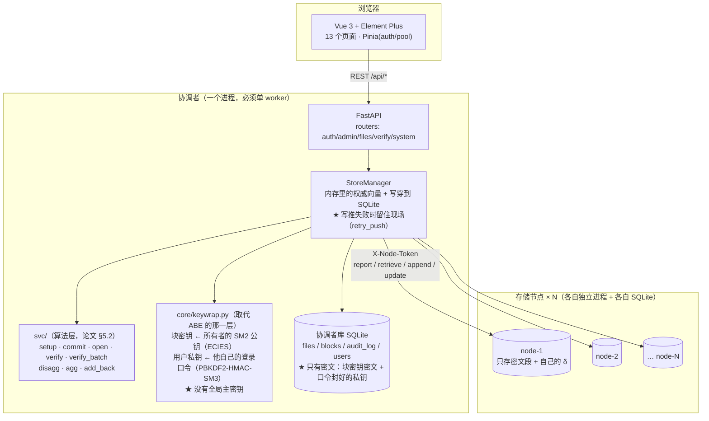
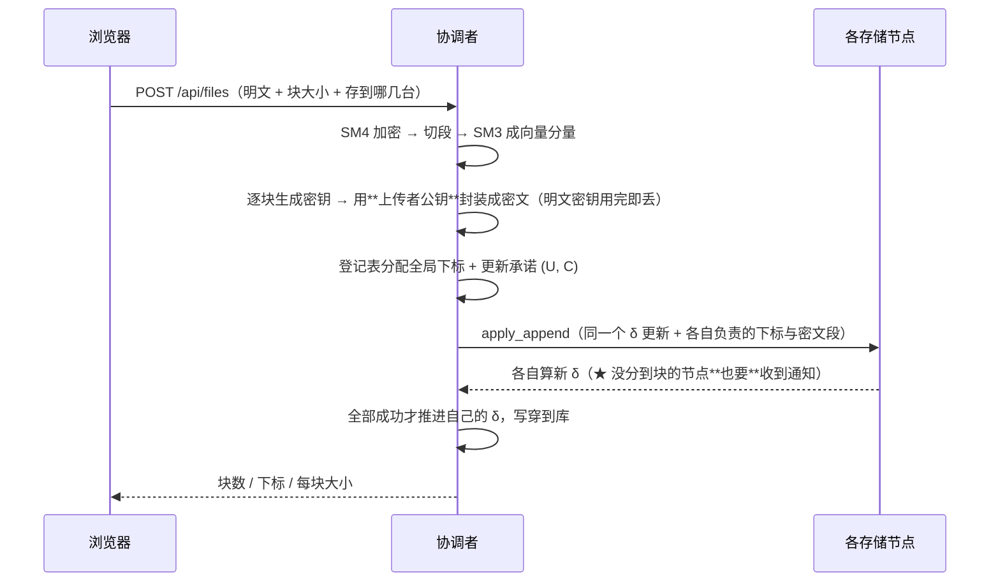
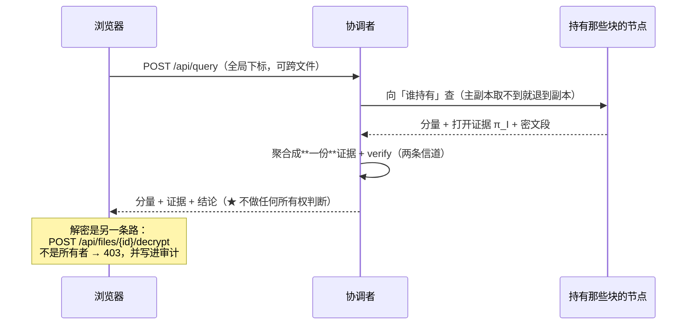

# 架构与说明（答辩用）

> 这份文件有两个用途：
> 1. **第 1 节是「需求 ↔ 实现」一页对照表 —— 答辩第一页就用它**；
> 2. 后面是架构图、分层说明、关键不变式、以及「做/不做」的取舍清单。
>
> 想快速跑起来看效果：点仓库根目录的 `一键启动.cmd`（详见 `README.md`）。

---

## 1. 需求 ↔ 实现（一页对照表）

| # | 需求原句 | 实现落在哪 | 证据（可当场指给评委看） | 状态 |
|---|---|---|---|---|
| 1 | 系统化：**Vue 前端、管理员/用户登录、数据库、多方控制、数据本地存储** | 前端 `frontend/`（Vue 3 + Element Plus + Pinia，**13 个页面**）；登录 `backend/routers/auth.py`（JWT + bcrypt + **登录时口令解封私钥**）；库 `backend/models.py`（SQLite/SQLAlchemy）；每个存储节点**各自的** SQLite（`node_service/persist.py`） | 界面逐页走一遍；`tests/test_api.py::Test认证` | ✅ |
| 2 | 选择若干证据验证、聚合验证、**满足条件才能验证** | 验证：`POST /api/query`（一次查询 = 一份证据，可**跨文件**）；聚合：证据池页 `PoolView.vue` + `svc.agg`；**跨文件批量验证**：`svc.verify_batch` + `POST /api/query/verify-batch` | `tests_core/test_scheme.py::Test批量验证`（12 条，含反面对照）；`tests/test_api.py::Test批量验证`（8 条）。⚠ **「满足条件才能验证」这半句没做** —— 见 §5 取舍 1 | ✅ 有取舍 |
| 3 | **多客户端模拟多节点，文件分块存多节点** | N 个**独立进程**（`node_service/`），台数可配（`start_all.py --nodes N`）；分块与分发 `core/store.py::_plan`；**上传时可勾「存到哪几台」**（手动指定分发） | `tests/test_replica_nodes.py`（真起进程、真停一台）；`tests/test_store.py::Test手动指定分发`；存储节点页的块分布矩阵 | ✅ |
| 4 | **访问单人的多个文件 / 多人的多个文件** | 文件列表页（按所有者筛 + 按名搜）；`GET /api/files` 返回**所有**文件的「我能不能解密」 | `tests/test_api.py::Test文件可见性`；界面筛一遍 | ✅ |
| 5 | **分解再聚合**（1,3,7 → 1,3,5） | `svc.disagg`（拆子集）+ `svc.agg`（两份聚一份）；接口 `POST /api/evidence/disagg`；界面证据池页 4 步流程 | `tests/test_api.py::Test分解再聚合`；现场：拆 `{1,3,7}`→`{1,3}`，补 `{5}`，聚成 `{1,3,5}` 验证通过 | ✅ |
| 6 | **同一份数据由多个用户共享**（不同权限） | ⚠ **已按老师要求撤掉**：原先靠 ABE 的按块策略（`user:` 属性 + `block_policies`）。现在语义收紧成**只有所有者能解密**——“多用户”保留在**验证**那条线上（所有人都能验所有人的文件，见第 2 条）。要恢复共享得给 `blocks` 加一张“额外封装”表，**不是回到 ABE** | 反面对照：`tests/test_api.py::Test解密门::test_默认就是只有所有者`、`Test两条线::test_管理员也解不开别人的文件` | ⚠ 有取舍 |
| 7 | **所有者修改文件** | `PATCH /api/files/{id}`：`op=modify`（改一块）/`op=append`（追加）/`op=truncate`（**删掉末尾的块**，三步链路：节点先 `RmvStorage` 交回 → 协调者自扮全持有者发 `del` → 再下发；**只能删向量末尾**，见 §5 取舍 3） | `tests/test_store.py::Test改块`、`Test追加`（含"追加→重启→照样解得开"）；截断：`tests/test_truncate.py`(15) + `tests/test_api.py::Test截断`(7) + `tests/test_truncate_nodes.py`(2，4 台**真节点进程**) | ✅ |
| 8 | **ABE** | ⛔ **已按要求整个切除**（`core/abe.py`/`policy.py`/`fabeo.py`/`vendor.py`/`_vendor/`/两个路由/三份测试全删）。换成 `core/keywrap.py`：块密钥用**所有者的 SM2 公钥**封（ECIES），用户私钥用**他自己的登录口令**封（PBKDF2-HMAC-SM3） | `tests/test_keywrap.py`（36 条）；`tests/test_api.py::Test解密门`、`Test密钥不放库里` | ✅ 已替换 |
| 补 | 性能图表页 | `/perf`（**没引 ECharts**，纯 CSS 条形；数字全部标注来源） | 页面 + `scripts/bench_batch.py` | ✅ |
| 补 | 存储证明 PoR | `core/store.py::pos_audit` + `POST /api/por` + 节点页按钮 | `tests/test_store.py::Test存储证明` | ✅ |
| 补 | 审计回放 | `/audit` 页：按**对象**或**操作者**精确匹配，把一份文件的完整经历按时间放一遍 | `tests/test_api.py::Test审计回放`（4 条） | ✅ |
| 补 | 写推失败与**补推** | `core/transport.py::WriteError`（带“哪几台没跟上 + 它们的请求体”）+ `core/store.py::retry_pending` + `backend/manager.py::retry_push`（连**落库**一起补）+ `GET /api/nodes/pending` / `POST /api/nodes/retry-push` + 集群页的待补推横幅。★ **写失败还会自己先试**：`Settings.retry_auto/retry_interval_s/retry_max_attempts`（后台线程定时重试、**有次数上限**，用完就停下来喊人；人工补推会重置轮次） | `tests/test_write_failure.py`（13 条，含反面对照“重传会被拦下”）；`tests/test_api.py::Test写失败补推`（2 条，含“没人点也会自己收敛”与“次数用完就停下”） | ✅ |
| 补 | **块大小标定与顾问** | `scripts/bench_blocksize.py` 实测曲线（256 B ~ 8 KB 六档；证据在每档都恒 256 B；带反面对照）→ `backend/advisor.py`（规则只有这一处）+ `POST /api/plan`（**只读**）：给文件大小就建议怎么切，并带上“为什么 / 别的切法多久 / 依据哪次实测”；放不下时直说 `ok=false`。前端上传卡的「自动（推荐）」那一档就是问它 | `tests/test_advisor.py`（15 条）+ `tests/test_api.py::Test块大小顾问`（5 条）；`scripts/bench_blocksize.py` 的输出表；规划 §13.24 | ✅ |
| 补 | **故障演练**（把「验证失败」演出来） | 证据池的「故障演练」开关：把**要发出去的那一份副本**改坏一个值再验 → 界面上直接看到真实的失败与**环节名**、以及是哪一份不合格。★ 只改发出去的副本，不动池子、更不动服务器数据；存储层真损坏的实测见规划 §13.21 | 浏览器实测（两种失败形态都跑过）；`tests/test_api.py::Test验证环节名` | ✅ |
| 补 | **前端单元测试** | `frontend/tests/`：验证失败的标题/副标题文案（`utils/format.js` 里的纯函数）。用 **Node 自带的 `node --test`**，**零新依赖**（规划 §2.10 不引新东西，所以没上 vitest） | `cd frontend; npm test`（**8 条**） | ✅ |
| 补 | 验证失败**环节名** | `verify.code` 是整数（0/1/2/3），调用方要“哪一步没过”就得自己查表 —— 而前后端各写一张表必然分叉。所以后端直接给 `verify.code_name`（`OK` / `BAD_SHAPE` / `BAD_S_I` / `BAD_LAMBDA`），**名字只从 `VerifyCode` 枚举派生** | `tests/test_api.py::Test验证环节名`（5 条，含“偷改一个分量 → 环节名必须指到 `BAD_LAMBDA`”）；验证页 / 文件详情页 / 批量验证三处界面都显示它 | ✅ |

---

## 2. 架构图

### 2.1 进程与模块



**为什么协调者必须单进程单 worker**：全局向量在内存里（设计 B 的代价），多 worker 会各持一份、直接不对。

### 2.2 一次上传（写路径：需要**所有**节点在线）



### 2.3 一次验证（读路径：**验证不受限**）



---

## 3. 分层与目录

| 层 | 位置 | 职责 | 不该做的事 |
|---|---|---|---|
| 算法 | `svc/` | 向量承诺（Setup/Com/Open/Ver/**BatchVer**/Disagg/Agg）、PoR | 不认识文件、不碰数据库、不碰 HTTP |
| 引擎 | `core/` | 全局会话与 CRS 引导、`VectorStore`（分片/承诺/增量）、节点状态与传输、SM 算法、**密钥封装（`keywrap.py`）** | 不认识"用户""权限"这类应用概念 |
| 节点 | `node_service/` | 独立进程，各持自己的 SQLite；**一律要求节点令牌** | 不持有完整明文、不知道块密钥是谁的 |
| 协调者 | `backend/` | 认证、文件账目、写穿、审计、把算法包成 REST | **不留明文密钥**（只有封装好的块密钥），也**不留明文用户私钥**（只有口令封好的那份） |
| 界面 | `frontend/` | 13 个页面；Pinia 只放 `auth` 与 `pool` | 不做安全判断（只做体验） |

**数据流一句话**：明文 → SM4 密文 → 切段 → SM3 分量 → 向量承诺 → 分发到 N 台；
验证只需 δ 与该份证据；解密需要**所有者手里那把 SM2 私钥**。

---

## 4. 关键不变式（红线）

写代码时守住这些，出问题基本都能定位。每条都配了**钉住它的测试**：

1. **协调者不留明文密钥。** `upload(key_sink=…)` / `read(key_of=…)` 都是必填参数 —— 逼调用方回答"这把钥匙放哪"。密钥的唯一去处是**封装好的块密钥**（落库那一列）。
   → `tests/test_api.py::Test密钥不放库里`（扫库文件，明文块密钥与明文私钥都搜不到）
2. **设计 B：一条全局向量。** 所有文件共享同一串下标空间，所以"一份证据横跨多文件"成立。改回"一文件一向量"，`svc.agg` 的前提就没了。
   → `tests/test_store.py::Test跨文件::test_一个证据横跨两个文件`
3. **`_plan()` 是「谁持有哪块」的唯一出处。** 记账、推数据、自检全用它，不可能出现两份定义不一致。副本**不占**全局位置（`n` 不乘副本数）。
   → `tests/test_store.py::Test副本`
4. **写路径要所有节点在线；读路径允许主副本掉线。** 副本保的是"已存数据读得出"，不是写入可用性。
   → `tests/test_replica_nodes.py`（真停掉一台进程）
5. **协调者内存权威 + DB 写穿；启动时与各节点对账，不同步就拒绝启动。**
   → `tests/test_api_distributed.py::Test模式::test_拒绝启动`（含"节点数据被清空"的那种）
6. **节点一律要求 `X-Node-Token`**（`secrets.compare_digest`），否则 `/node/reset`（破坏性）与 `/node/retrieve`（会吐密文）只靠"绑回环"护着。
   → `tests/test_nodes.py::Test鉴权`
7. **面向用户的文案里不能出现 Markdown 标记**（`` ` ``、`**`）。它会被原样显示出来，看着像坏掉的界面。
   → 我在这条上踩过 3 次（`FilesView` 一个、`core/store.py` 两处报错文案），现在都清了。
8. **后端必须单进程单 worker**（全局向量在内存里）。
9. **一次写要么全推完，要么把现场留住等补推 —— 绝不能靠“重传一次文件”修。**
   写推失败时协调者自己的 δ **不推进**，但登记表**已经分配过**那批下标了；
   此时重传会拿到新下标，并撞上“登记表游标与向量长度不一致”。唯一的出路是
   **补推同一份负载**（`WriteError` 里带着），而且补完**还要把那次操作欠下的落库补上**
   —— 否则重启时会以“节点与协调者不同步”被拦下，看起来像“补推把系统修坏了”。
   → `tests/test_write_failure.py::Test不能靠重传修`、`Test补推`；
   `tests/test_api.py::Test写失败补推::test_失败留现场_不能接着写_补推后完全收敛`
10. **同一个库只允许一个 app 实例做写操作**（全局下标是协调者按**内存里的 n** 分配的，
    不是从库里取的计数器）。一旦有第二个实例写过，第一个的内存向量就永久落后，
    它再写就会撞 `UNIQUE constraint failed: blocks.global_index`。
    所以**新起实例做写操作用例**时，那个用例自己也必须走新实例（它会从库里重读 n）。
    → `tests/test_api.py` 的 `late_client` 夹具；
    `Test持久化::test_重启后还能继续追加` 之后的所有写类用例都据此改写
    （这条规矩是被**全量**回归抓出来的：单跑那些用例全过，一起跑才炸 ——
    所以"新加写类用例"必须跑一次整个模块/全量，不能只跑 `-k`）
11. **验证结论必须给出失败环节名，而且名字只能有一个出处。**
    `verify.code` 只是个整数，界面要显示“哪一步没过”就得查表；前后端各写一张表
    必然分叉（策略解析器已经吃过一次这个亏）。所以名字由 `manager.verify_code_name()`
    从 `VerifyCode` **枚举**派生，未知值给 `UNKNOWN_<n>` 而不是抛异常 ——
    它是只读响应里的一个展示字段，为一个没见过的整数把整条验证路径打挂不值得。
    → `tests/test_api.py::Test验证环节名`

12. **“只有自己才能解密”必须落在密码学上，不能只落在接口上。** 两条一起看：
    块密钥用**所有者的 SM2 公钥**封装（第 1 层），用户私钥用**他自己的口令**
    封装后才入库（第 2 层）。少任何一条都会退化成“一句应用层的话” ——
    只做第 1 层的话，库被拿走就等于全泄露（私钥明文在里面）；
    只做第 2 层的话，块密钥明文在库里，同样一眼看穿。
    **推论**：登录时才能把私钥解封出来（只放内存），登出/重启即丢；
    改口令必须**重新封装私钥**，而它只在本人登录那一刻在内存里 ⇒ **管理员改不了别人的口令**。
    → `tests/test_keywrap.py`（36 条）；`tests/test_api.py::Test解密门`、`Test密钥不放库里`

---

## 5. 取舍清单（做 / 不做，以及为什么）

答辩最容易被问的就是这些。**上面这些"不做"不是漏做，是想清楚之后的选择。**

### 5.1 需求 2 的另一半「不满足条件就不能**验证**」—— 没做

需求原句是「…、满足条件才能验证」，字面要求拦在**验证侧**。本项目选的是
**验证不受限 + 解密受限**（另一句需求写着"内科护士只需要**查询并验证**密文的完整性，
不需要解密"）。理由：

* δ 是公开的、验证是**公开可验证**的 —— 证据直接从节点就能拿，服务端"不发"拦不住谁；
* 真正**强**的门只有解密那道（密码学强制：没有钥匙就是解不开）。

**代价**：没有解密权限的用户照样能验证任意文件的完整性（这正是演示卖点之一）。

### 5.2 跨文件批量验证 —— 做了，但它**更慢**（照实报）

| 做法 | 耗时（|N|=1024、l=256、64 份单块证据） |
|---|---:|
| 逐份 `svc.verify` | 283.1 ms |
| **批量 `svc.verify_batch`（发货实现）** | **475.3 ms（慢 1.68 倍）** |

**为什么慢**：单份验证已经被优化成 `add_back` 链的 **O(ℓ|I|) 次小指数模幂**；
批量每条方程每份还要多摊两次 ℓ 位指数模幂。**它值钱的地方是"一次结论"，不是速度。**

两条纪律：① 必须**两条信道（S 与 Λ）都合** —— 只合一条会"看起来快一大截"，
那是少验了一半；② 必须带**反面对照**（翻掉一个值必须被拒），否则"更快"可能只是因为它没在验。

### 5.3 截断（删末尾几块）—— **做了**

论文 §8.2 的 `op = del`。完整链路是**三步**，每一步都有它非有不可的理由：

1. **先让"部分相交"的节点交回**（`POST /node/drop`，即论文的 `StrgNode.RmvStorage`）。
   底层 `vds.updates._apply_del` 要求每个节点与待删集合 `K`
   "要么全包含、要么全不相交"，**部分相交直接报错**；而我们的分片是
   「N 台轮转 + 每块 2 份副本」，一个跨台的末尾区间几乎必然部分相交。
   交回是**幂等**的（不在手里的下标直接跳过），所以"交回一半之后掉线"
   可以整次重来，不需要补推。
2. **协调者自己扮成"持有整个向量"的节点**来发起 `del`。
   `_push_del` 要求推送方持有整个 `K`（它要拆出 `π_K` = "把 K 挖掉之后
   那个向量的摘要"）—— 而 4 台轮转下**没有任何一台**能完整持有跨台的末尾区间。
   所以让协调者自己扮：它手里本来就有整个向量（`store.values`）。
   它的 `st` 必须是**空向量的摘要** `d(∅)`，正规算法是
   `specialize(crs, 0)` + `commit(crs_0, [])`（得到 `(g, 1)`）。
3. **推给每一台**（`POST /node/delete`）：节点自己按 `Υ∆` 算出新 `δ`，
   并把**自己手里那些被删块的密文真删掉**（不只是从 `I` 里划掉名字）。
   手里**整段包含** `K` 的节点走便宜路（`(S_I, Λ_I)` 一个字不改，只丢下标）；
   已交回（与 `K` 不相交）的节点做一次 `agg`；节点被删空则归一成规范空视图。

实测：`scripts/_probe_truncate2.py`（14/14）验到"协调者自算的 `δ'`
与对截断后向量重新 `commit` 一次**逐位相同**"，而且那个占位视图
`check_local_view()` 为真；
`tests/test_truncate.py`(15) + `tests/test_api.py::Test截断`(7) +
`tests/test_truncate_nodes.py`(2，4 台**真节点进程**) 钉住了正反两面。

**一条必须对用户说清的前提**：`del` 只认**全局向量末尾**的连续区间
（新摘要用到 `e_[n] = e_[n-k] · e_K` 这个因式分解），所以只有**最后写进
向量的那份文件**才删得动尾巴。别的文件会收到 400，并**点明**是哪几个下标卡住。

> **易混淆点**：`session.bootstrap()` 返回 `δ0 = (U=1, C=g)` —— 那是论文对"空**文件**"的
> 约定取值，**不能**当成 `d(∅)` 去参与 `add_back`/`disagg` 的运算
> （实测：算出的新摘要与一次性承诺对不上、`check_local_view()` 也是 False）。
> 能参与运算的 `d(∅)` 是 `(g, 1)`。代码注释里也标了。

### 5.4 `tune_for`（按文件大小自动挑参数）—— **不搬旧模型**

旧仓库那份 `tune_for` 是按**旧系统**标定的（16 字节一块、没有 ABE），
候选档位也是 `1~64 字节` 那一档 —— 照搬会给出**错的数量级**。
能用的是它那条思路：用本站自己的实测重新标定，产出"自动挑最快档 + 为什么"。

> ★ **这条思路已经落地了**：`backend/advisor.py` + `POST /api/plan` —— 同一件事
> （按文件大小自动挑参数），用**本项目自己的实测曲线**重新标定，并且把
> "为什么 / 别的切法多久 / 依据哪次实测" 一起给出来（见 §1 的「块大小标定与顾问」行
> 与规划 §13.24）。所以规划 §13.22「下一步」里第 9 条**不再是待办** ——
> **要做的事做完了，但不是靠搬那份代码**：旧模型只当参考。

### 5.5 批量验证里"只勾一部分机器"（手动指定分发）—— 做了

上传时可以勾「存到哪几台」，追加自动跟着**这份文件实际住的机器**走
（从各块的持有者推出来，不加字段、不用迁移）。
### 5.6 密钥层：从 ABE 换成“公钥封块密钥 + 口令封私钥”（**本次改动的主线**）

#### 改成什么样了

| | 旧（ABE） | 新（`core/keywrap.py`） |
|---|---|---|
| 块密钥怎么存 | 按**访问策略**封装（属性写在密钥里、策略写在密文里） | 用**所有者的 SM2 公钥**封装（ECIES） |
| 谁能解密 | 属性满足策略的人 **+ 管理员**（KGC 主密钥） | **只有所有者** —— 管理员也不行 |
| 用户私钥 | 由 KGC 按属性签发，主密钥单独放 `abe_msk.json` | 每个用户自己一对，私钥**用他自己的登录口令**封好入库 |
| 主密钥 | 有（单点信任，得单独保管） | **没有这种东西了** |
| 依赖 | `core/abe.py` + `core/policy.py`（+ 方案的 `fabeo.py`/`_vendor/`，**14.3 MB**） | `core/keywrap.py`，只用项目已有的 SM2/SM3/SM4 |
| 共享 | 有（grant 会真的重封装密文） | **没有**（要恢复得加一张“额外封装”表） |

删掉的东西（**不留接口、不留空壳**）：`core/abe.py`、`core/policy.py`、
`core/fabeo.py`、`core/vendor.py`、`_vendor/`、`scripts/install_vendor.py`、
`backend/routers/abe.py`、`backend/routers/policies.py`、
`tests/test_abe.py`、`tests/test_fabeo.py`、`tests/test_policy.py`，
以及 `users.attrs_json` 一列与 `blocks.base_policy` / `blocks.policy` 两列、
`GrantRow`/`AbeMpkRow`/`PolicyRow` 三张表。

#### 两处密码学落地

```
第 1 层 · 块密钥 ← 所有者的 SM2 公钥（ECIES）
         每次封装抽临时私钥 d，密文带 R = d·G；z = d·pk = sk·R
         SM4 密钥 = KDF(z, enc)，tag = KDF(z, tag ‖ R ‖ iv ‖ body)
第 2 层 · 用户私钥 ← 他自己的登录口令
         KEK = PBKDF2-HMAC-SM3(口令, salt, 20 万次) → SM4 密钥
         私钥（32 字节标量）用它加密 + 同样的 tag
```

**那个 tag 不是可有可无的**：SM4-CTR 不提供完整性。没有它，节点翻一位密文体
只会解出**另一个**块密钥，表现是“文件内容是乱的”而不是“这里被篡改了”。

**为什么第 2 层不能省**：只把私钥明文存库、靠接口判断“这是不是你的文件”，
那“只有自己”就只是**一句应用层的话** —— 谁拿到数据库谁就能解开全部文件。
现在私钥是**用口令包起来**的：数据库被拿走、连同这个文件一起被拿走，
**没有口令依然解不开**。口令本身不落库（库里只有它的 bcrypt 哈希，那是登录校验用的）。

#### 会话私钥：登录解封、只放内存、登出即丢

`users.sk_wrapped` 里只有密文。登录时用口令把它解封出来，挂到**这次令牌**上
（`StoreManager._keys`，**只在内存**）：

* 退出登录 → 丢掉 → 同一个令牌再调解密会得到“会话里没有私钥，请重新登录”；
* 后端重启 → 同样（这正是“私钥不落盘”的必然结果，也是**想要的**）——
  测试里专门钉了这一条（`Test持久化::test_重启后改过的块仍是新内容` 里那句
  “新实例上没登录过时，同一个令牌是解不开的”）。

#### 四个后果（都要在答辩时说）

1. **管理员不再有特权**：没有主密钥，他解不开别人的文件。安全性上的提升。
2. **管理员不能替别人改口令**：私钥是他自己的口令包的，替改 = 把他的私钥永久弄丢。
   后端直接 400 拦住，让他自己改（管理员可以停用他）。
3. **共享没了**：语义收紧成“只有自己”。详见上表。
4. **改别人文件的入口也收紧成“只有所有者”**：`PATCH /api/files/{id}` 的三个变体
   （`modify` / `append` / `truncate`）原来对**管理员**放行 —— 而管理员
   **读不到**（`can_decrypt` 只认所有者）、**查不到**（改块审计要管理员权限，
   所有者事后看不到）、也**察觉不了**（`content_digest` 按设计不更新、
   验证照样通过，文件列表上唯一的痕迹是 `version` 从 v1 变 v2）。
   四层叠在一起才是问题：**能写、读不到、不知道、拦不住**。
   现在统一成一句话：**改块要重新封装块密钥，这与上传是同一级别的权限**。
   反面对照：`Test改块::test_只有所有者能改_管理员也不行`、
   `Test追加::test_追加到别人的文件403`、`Test截断::test_不是所有者删不了`。
5. **块大小的实测数字要重新看**：`scripts/bench_blocksize.py` 那条曲线是
   **带 ABE 逐块封装**量的，现在封装换成 ECIES（更便宜），所以那些数字是**上界**。
   `backend/advisor.py` 里的系数仍然沿用旧实测，**偏保守**（不会低估耗时）。
   —— 这一点在 §6 的指标表里也标了。

### 5.7 为什么**没有** `can_fetch_evidence()`（发放侧那道门）

规划 Day 3 原本写了两个函数：`can_fetch_evidence()` 与 `can_decrypt()`。
今天的状态是：**`can_decrypt()` 在**（`backend/routers/files.py`，解密侧唯一的硬门），
**`can_fetch_evidence()` 故意不存在**，因为 §0.0 决策 2 已经把它作废了：

* 题目原文写的是“**所有用户都能够验证**……”—— 验证是公开能力；
* δ 公开、证据可以直接向节点要，服务端“不发”拦不住谁（详见 §5.1）；
* 真做出来只会是一道**看起来有、其实绕得过**的门 —— 那比没有更糟。

代码里也没有留一个“永远返回 True”的空壳函数：那种壳子会让人以为
“这里有权限判断”，不如根本不存在。**要找权限判断，只看一处：解密。**

### 5.10 Day 3 清单里的三个端点，为什么合并成了一个

规划写的是三个接口：`POST /api/files/{id}/evidence`（查所有者 → 算覆盖这些块的节点
组合 → 收凭证 → 写证据池）、`POST /api/evidence/aggregate`、`POST /api/verify`。
发货版长这样：

| 规划里的 | 发货版 | 为什么 |
|---|---|---|
| 上面那三个 | **`POST /api/query`**：给全局下标，一次拿回「分量 + **一份聚合证据** + 两条信道的结论」 | 设计 B 下所有块都在同一条向量里，“取 / 聚 / 验”之间本来就没有语义空隙；拆成三个接口只会让前端把同一份证据在三次请求里搬运，多两个失败点 |
| 跨文件的那一份 | `POST /api/query/files` | 设计 B 的招牌能力（一份证据横跨多文件、多用户） |
| 多份证据“一次结论” | `POST /api/query/verify-batch` | 需求原句「选择若干证据验证、聚合验证」的后半句 |
| 证据池 | 前端 `stores/pool.js`（**sessionStorage** 持久化）+ `POST /api/evidence/disagg` 负责分解 | 池子是“**这个浏览器手上攒的证据**”，不是系统状态；放服务端就得多一套权限与生命周期 |

★ 代价照实说：用的是 sessionStorage（不是 localStorage），所以**关掉标签页池子就没了**
—— 它只活一次会话；刷新页面不影响。

---

## 6. 数字（照实报）

| 项 | 数字 | 怎么得到的 |
|---|---|---|
| 全量回归 | **829 通过 / 0 失败 / 0 错误 / 0 跳过**（本次实测 552.4 s） | `python -m pytest -q`（`--junit-xml` 解析）：`tests/` **445** + `tests_core/` **384**。★ 比上一轮的 987 条**少 158 条**，正是因为把 ABE 那一整块切掉了（`test_abe.py` / `test_fabeo.py` / `test_policy.py` 三个文件 + 接口层的策略库 / 方案对比 / 属性策略三组）—— **不是"删掉了不跑的测试"，是把被测的功能去掉了**；算法的 384 条一条未动 |
| 前端页面 | **13** | `frontend/src/views/*.vue` |
| 存储节点 | 默认 4，可配 | `scripts/start_all.py --nodes N` |
| 一次上传（4 块）| 约 1.9 s | ① |
| **上传 1 MiB（1024 块）** | **37.6 s**（测试档 \|N\|=512） | `tests/test_bigfile.py` —— Day 2 那条"传 1 MB"验收的实测 |
| **一次验 1024 块** | **1465 ms**，证据仍 **128 B** | 同上。证据大小 = 2 × \|N\|/8，**与块数无关** |
| **块大小标定**（同一份内容、只改块大小） | 上传 **2838.8 → 49.1 ms**、全量验证 **1477.2 → 24.4 ms**（256 B → 8 KB 六档） | `scripts/bench_blocksize.py` （\|N\|=512、l=256、4 台节点、单进程）。每块代价从 22.2 ms 降到 12.3 ms；**证据在每一档都恒 256 B**；带反面对照（翻一个值必被抓住）。⚠ **这条曲线是带 ABE 逐块封装量的** —— 现在封装换成了 ECIES（更便宜），所以这些数字是**上界**，`advisor.py` 沿用它 ⇒ 估算偏保守 |
| 验证**一份**覆盖 64 块的证据 | 266.7 ms | `scripts/bench_batch.py` |
| 逐块各查一次（64 份） | 4375.5 ms（比合成一份慢 2.4 倍）| 同上 |
| 批量验证（64 份） | 475.3 ms（比逐份慢 1.68 倍）| 同上 |

> ① 数字来自本机实测，不同机器会差；`scripts/bench_batch.py` 可重跑。
>
> ⚠ **文件大小其实由「块数上限」（`n_max`）决定，不是字节数。** 刚 `--reset --demo` 建好的
> 演示库已用掉 12 个位置
> ⇒ 1 MB（1 KB 块 → 1024 块）会被 **400** 拒；要传大文件得先把块调大（如 2 KB → 512 块）
> 或清库。请求里的下标列表上限 `backend/schemas.py::MAX_INDICES = 1024` **必须 ≥ `n_max`**
> —— 它原来是写死的 512，于是出现「传得上 1 MB、却一次验不完」（已修）。
>
> ⚠ **秒表与估算会差很多，不是 bug**：界面上传卡的"预计耗时约"用的是
> 19 ms/块（只算**逐块承诺**），不含每块的块密钥封装与全网推送。
> 实测 200 块（每块 1208 B）全流程 **≈61 s**（≈0.31 s/块），而同一次的估算只有 3.8 s
> —— 差 16 倍。界面上已注明系数口径，但这个数确实会让人低估。

---

## 7. 怎么自己验一遍

```powershell
# 1) 一键起服务（4 台节点 + 后端 + 前端），然后浏览器里按演示脚本走
一键启动.cmd

# 2) 全量回归
python -m pytest -q

# 3) 端到端冒烟（20 步，含批量验证 / 读路径缺块 / 待补推 / 密钥模型 / 管理员也解不开 / 截断的使用前提 / 块大小顾问）
#    ⚠ 必须带 --base：脚本默认打 8099，而一键启动把后端起在 8000
python scripts/smoke.py --base http://127.0.0.1:8000

# 4) 前端单元测试（Node 自带的 node --test，**零新依赖**）
cd frontend; npm test; cd ..

# 5) 批量验证的代价（含反面对照）
python scripts/bench_batch.py --blocks 64 --files 8
```
